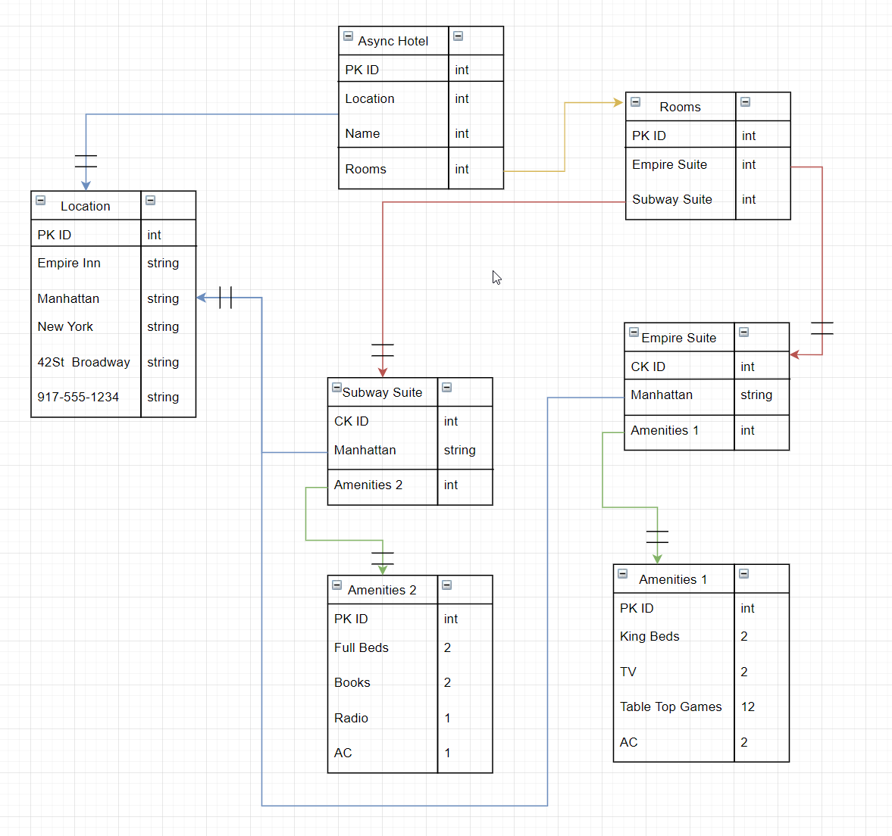

# Async-inn

### Name: Jona Brown
### Date: 07/26/2021
## Summary
The Async Inn is an API that represents all Hotels in the Async name, including the rooms and the amenities for each for each of the rooms. These are all turned into JSON data, in which you are able to PUT, POST, GET and DELETE new hotels, rooms and amenities inside of the API.  
Additionally, we have individual controllers that handle CRUD requests by using their appropriate service worker. This wiring makes it possible to perform a variety of requests, along with different types of requests for each controller item (hotels, rooms, amenities and such)

Tables -  
- Async Hotel - Contains the location info, amount of rooms and name of hotel.
- Location - 1 to 1 relationship with Async hotel, contains all of the locations that the Async hotel exists.
- Rooms - 1 to many relationship with Async hotel, contains the different types of rooms.
- Suite - 1 to 1 with relationship rooms, a room may be an empire suite, which has a location of Manhatttan (from location)
- Amenities - 1 to many relationship with suites, as there would be a lot of different amenities per room. 

## Data Transfer Objects
-DTOs give you the ability to hide data from the client that they would not want/need. Think IDs and passwords for a database of usernames.  
Additionally, New DTO classes give you the ability to write a simple object (A Hotel with a name, phone number and address) that would then parse out all of 
the info into a regular non DTO class and store it into the database. This info is then returned to the client in the form of a DTO.
